# Project Title

EShop

## Authors

- [@ngocnam11](https://www.github.com/ngocnam11)

- [@Khh-vu](https://www.github.com/Khh-vu)

## Introduction

A user-friendly and functional E-commerce app with intuitive UI, and clear, organized content.

## Technologies Used

- [Flutter](https://flutter.dev)
- [Firebase](https://firebase.google.com)

## Screenshots

### Login Screen

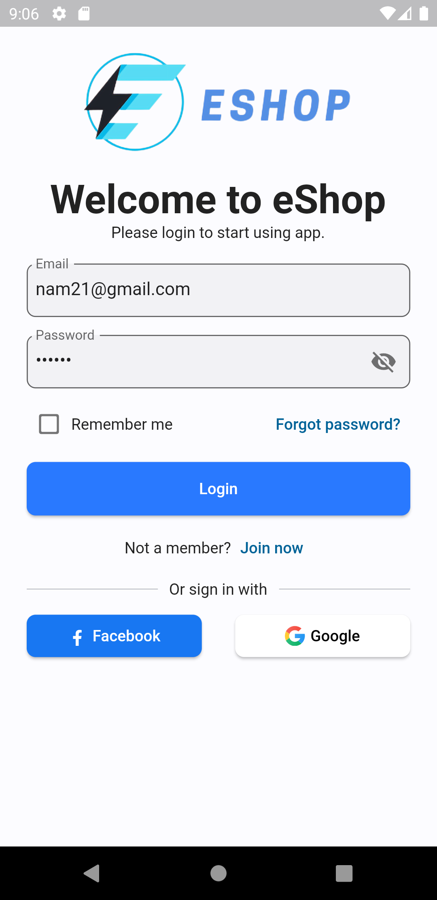

### Signup Screen

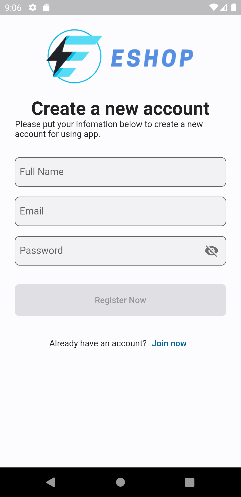

### Home Screen

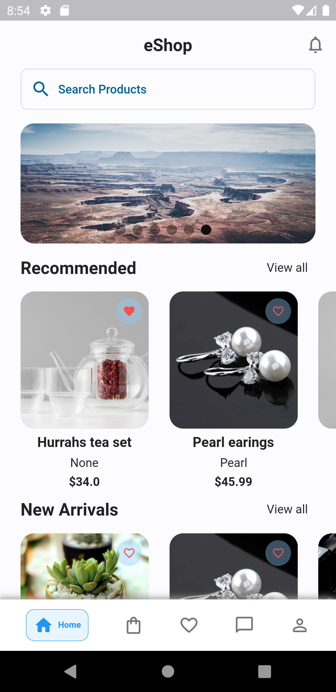

### Cart Screen

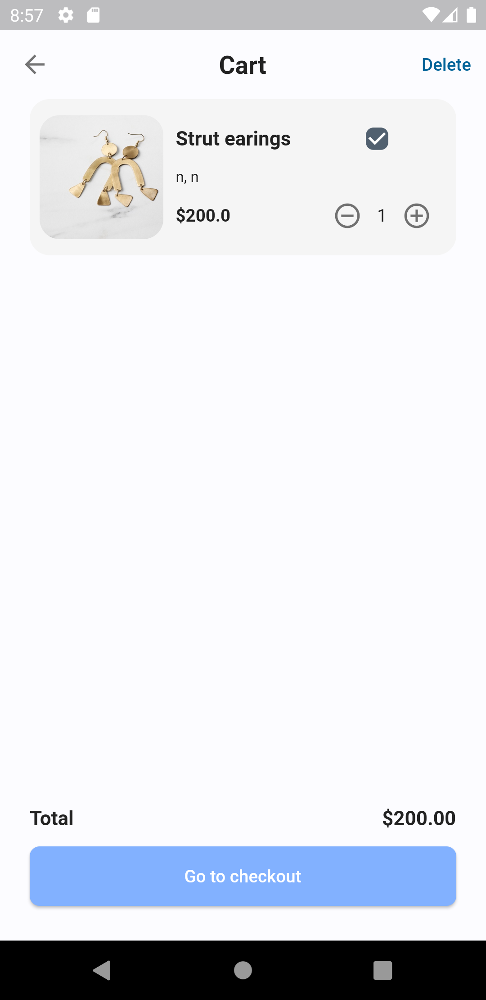

### Wishlist Screen

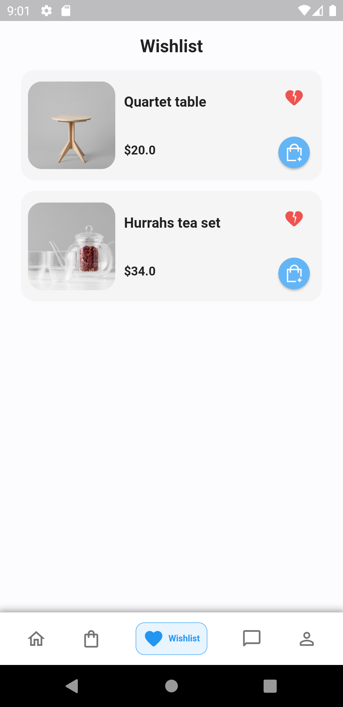

### Chat Screen

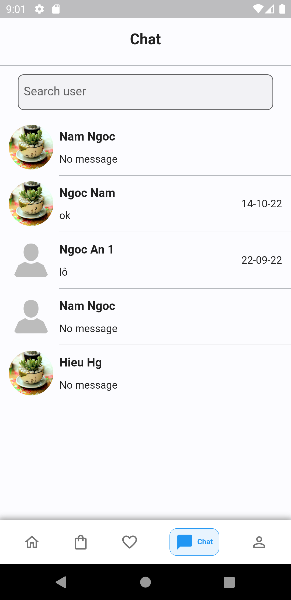

### Profile Screen

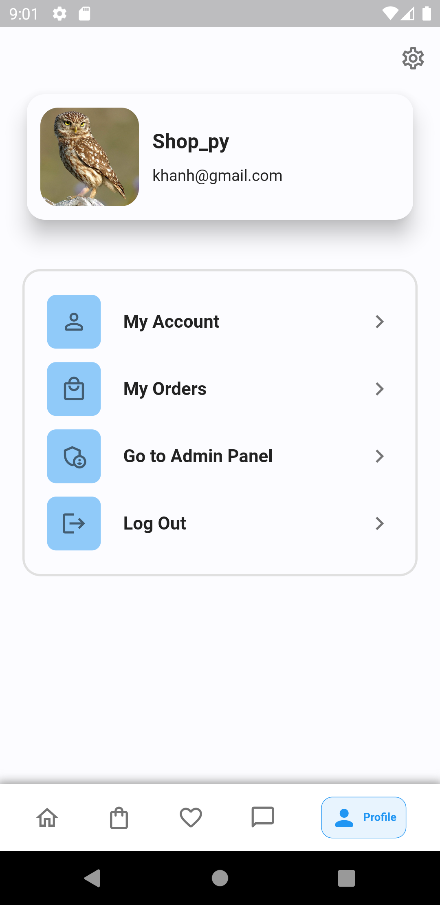

### Product Detail Screen

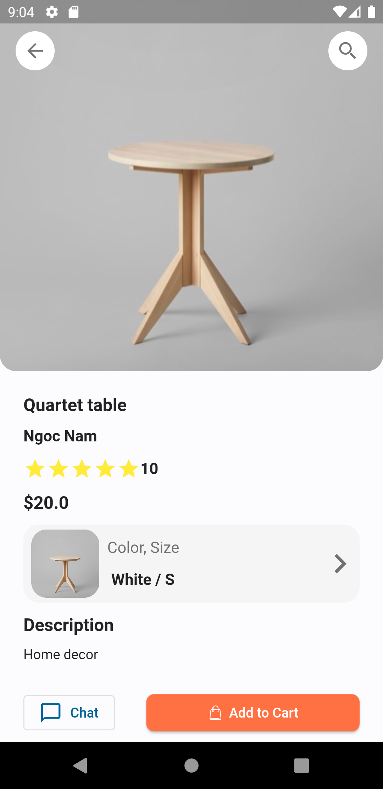

### Select Options Screen

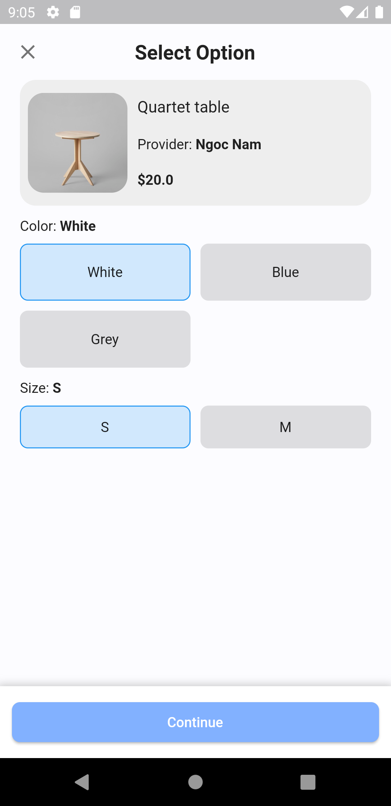

### Checkout Screen

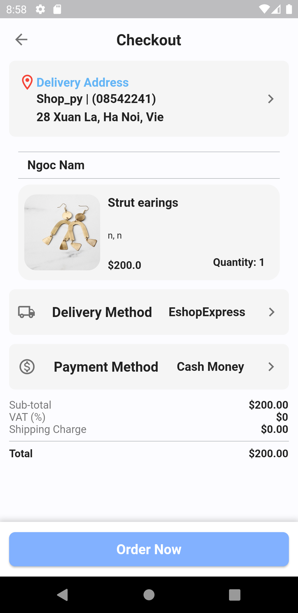

### Order Confirmation Screen

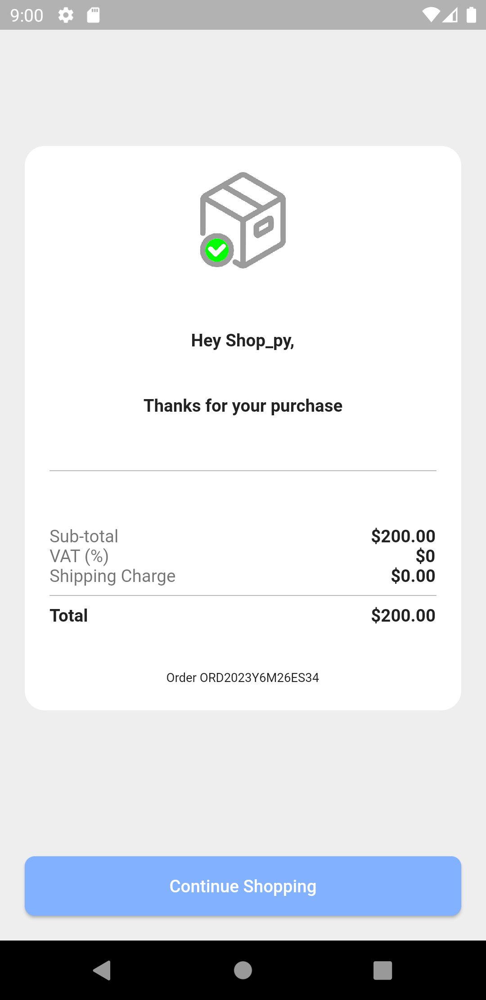

### My Account Screen

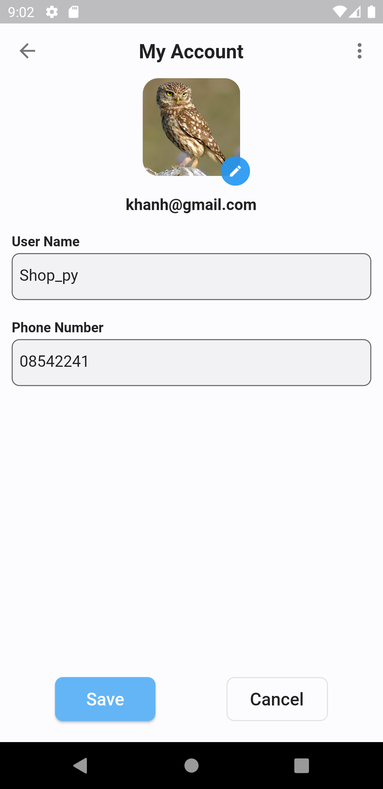

### My Orders Screen

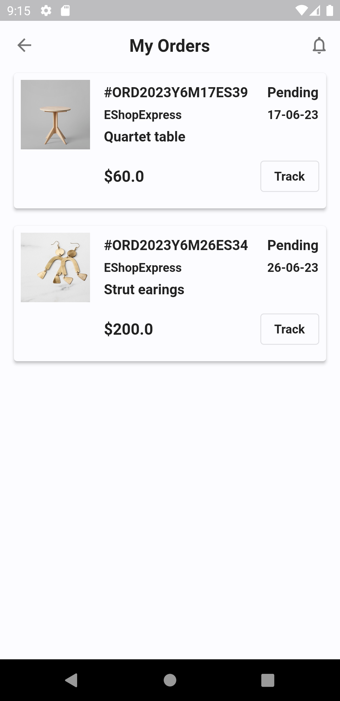

### Admin Panel Screen

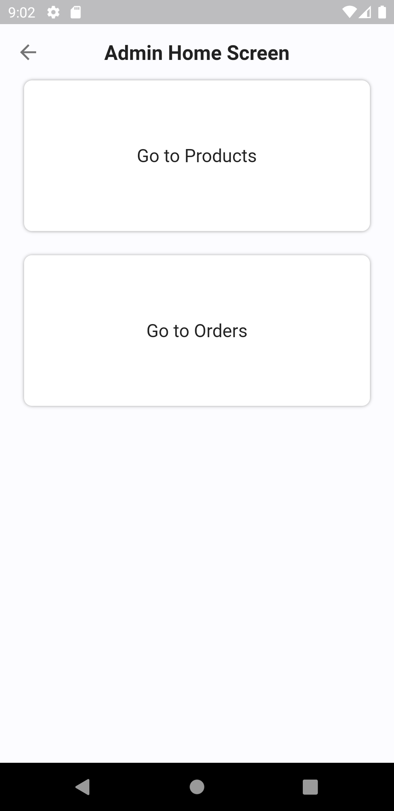

### Admin Products Screen

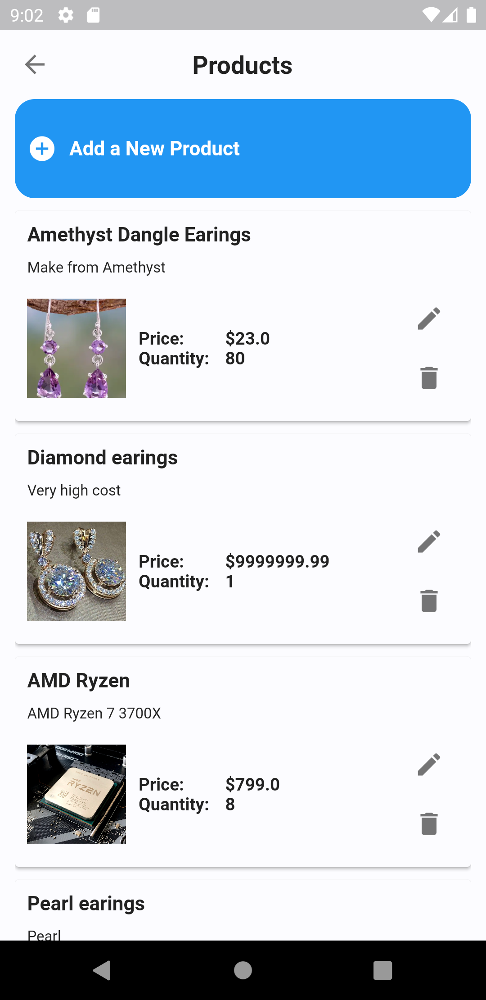

### Admin Orders Screen

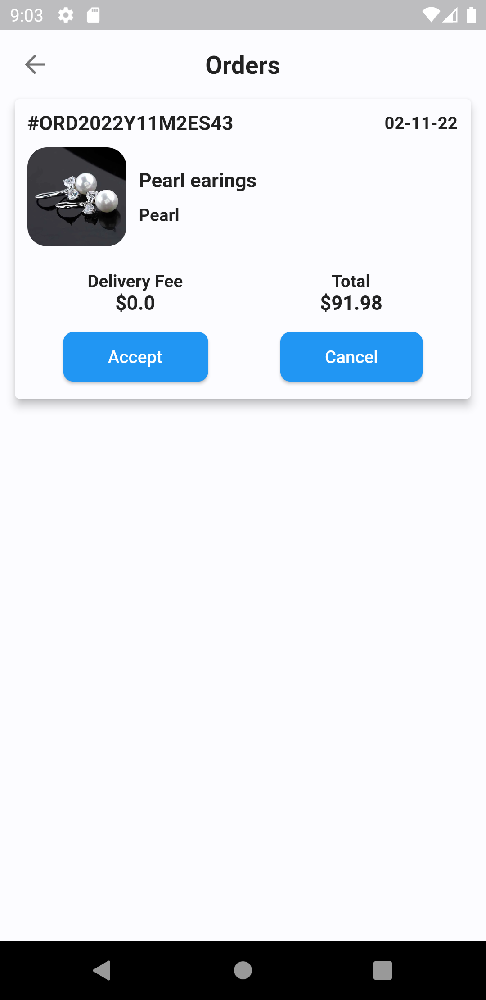

### Category Detail Screen

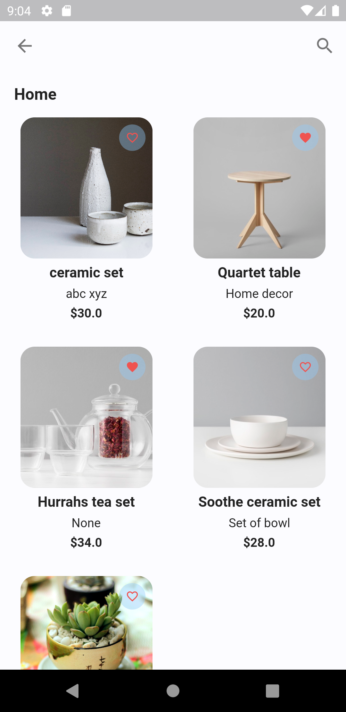
